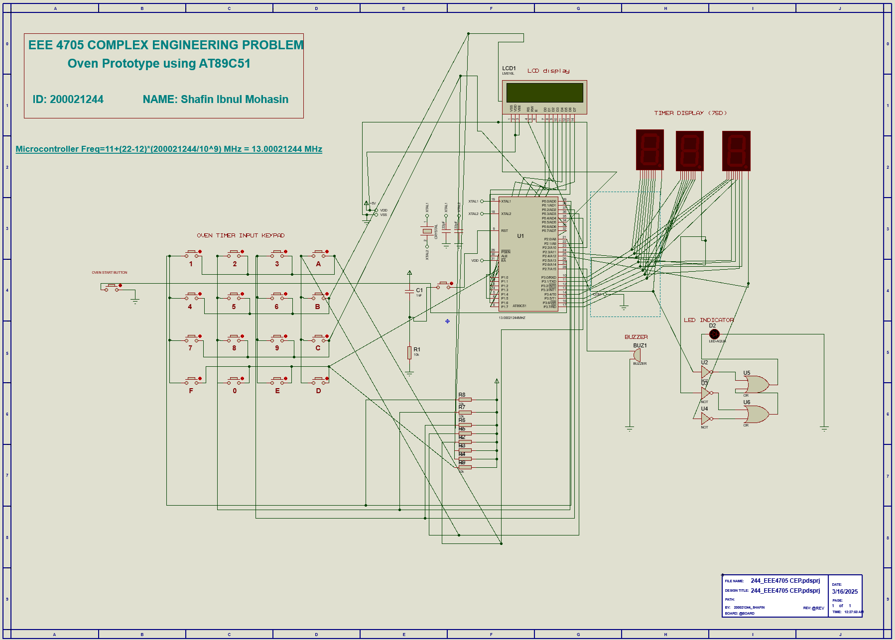
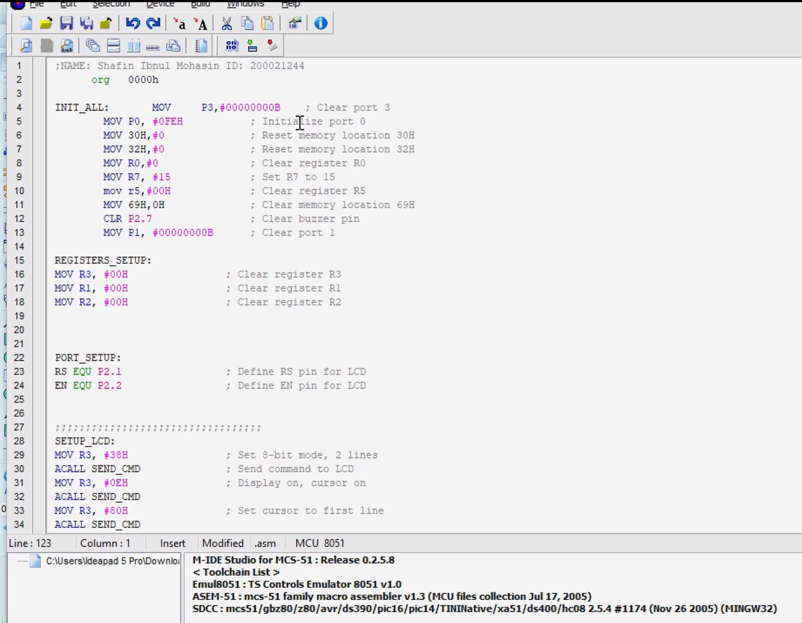

# Microcontroller-Based Interactive Oven Control System with Real-Time Timer Operations and Emergency Features Using AT89C51

 <!-- Add a banner image of your circuit -->

## 📋 Project Overview

A fully functional interactive oven control system prototype designed for Jurgen Oven Corporation using the AT89C51 microcontroller. The system features real-time countdown timer operations, LCD messaging, audio notifications, and emergency stop functionality, providing an engaging user experience while the oven operates.

## ✨ Features

- **Flexible Timer Input**: Set cooking time from 5 to 300 seconds via keypad
- **Real-Time Countdown Display**: Three 7-segment displays show remaining time
- **Interactive LCD Messaging**: 
  - Display interesting facts for timer > 60 seconds (rotates every 20 seconds)
  - Custom messages for timer ≤ 60 seconds
- **Visual Status Indicators**: LED configuration clearly indicates oven operational status
- **Audio Notification**: Buzzer alerts user when cooking cycle completes
- **Emergency Stop Function**: Immediate system halt capability for safety
- **User-Friendly Interface**: Intuitive keypad control with Start/Stop buttons

## 🛠️ Hardware Components

- **Microcontroller**: AT89C51 (Clock frequency: 13.00021244 MHz)
- **Display Units**:
  - 3× Seven-Segment Displays (countdown timer)
  - 1× 16×2 LCD Display (messages)
- **Input**: 4×4 Matrix Keypad
- **Output Indicators**:
  - Multiple LEDs (status indication)
  - 1× Buzzer (completion alert)
- **Power Supply**: 5V DC

## 📂 Repository Structure
```
├── Code/
│   ├── main.asm                    # Main assembly source code
│   └── README.md                   # Code documentation
├── Proteus/
│   ├── oven_control.pdsprj         # Proteus project file
│   ├── circuit_schematic.png       # Circuit diagram image
│   └── README.md                   # Simulation instructions
├── Documentation/
│   ├── Project_Report.pdf          # Detailed project report
│   ├── Component_List.md           # Bill of materials
│   └── User_Manual.md              # Operating instructions
├── Demo/
│   ├── demo_video.mp4              # Working demonstration
│   └── screenshots/                # System screenshots
├── images/                          # Images for README
└── README.md                        # This file
```

## 🚀 Getting Started

### Prerequisites

- **Proteus Design Suite** (for circuit simulation)
- **Keil µVision** or **MIDE-51** (for assembly code compilation)
- **AT89C51 Programmer** (for hardware implementation, optional)

### Running the Simulation

1. **Clone the Repository**
```bash
   git clone https://github.com/shafin244/Microcontroller-Interactive-Oven-Control-System-AT89C51.git
   cd Microcontroller-Interactive-Oven-Control-System-AT89C51
```

2. **Open Proteus Project**
   - Navigate to `Proteus/` folder
   - Open `oven_control.pdsprj` in Proteus Design Suite

3. **Load Hex File**
   - The compiled `.hex` file is already linked in the Proteus project
   - If needed, recompile `Code/main.asm` using MIDE-51 or Keil

4. **Run Simulation**
   - Click the play button in Proteus
   - Use the virtual keypad to input time and control the oven

## 💻 Code Compilation

### Using MIDE-51

1. Open `Code/main.asm` in MIDE-51
2. Set crystal frequency to 13.00021244 MHz
3. Compile to generate `.hex` file
4. Load the `.hex` file into Proteus microcontroller

### Using Keil µVision

1. Create a new project for 8051 (AT89C51)
2. Add `main.asm` to the project
3. Configure clock frequency
4. Build project to generate `.hex`

## 🎮 How to Use

1. **Power ON**: System initializes with LCD welcome message
2. **Enter Time**: Use keypad to input desired cooking time (5-300 seconds)
   - Press digits to enter seconds
   - Example: Press `1`, `2`, `0` for 120 seconds
3. **Start Cooking**: Press START button
   - Countdown begins on 7-segment displays
   - LEDs indicate oven is operational
   - LCD displays facts (if time > 60s) or custom messages
4. **Completion**: Buzzer sounds when timer reaches zero
5. **Emergency Stop**: Press STOP button anytime to halt operation immediately

## 📊 System Operation

### Timer Ranges

| Time Input | LCD Behavior |
|------------|--------------|
| 5-60 seconds | Display custom messages |
| 61-300 seconds | Display rotating facts (changes every 20 seconds) |

### Keypad Configuration

| Key | Function |
|-----|----------|
| 0-9 | Numeric input |
| A | START |
| B | STOP/EMERGENCY |
| C | CLEAR |
| D | ENTER |

## 📹 Demo Video

Watch the complete working demonstration:

[](Demo/demo_video.mp4)

*Click to view the project in action*

## 🖼️ Screenshots

### Circuit Simulation


### Working System
<table>
  <tr>
    <td><br/><i>Idle State</i></td>
    <td><br/><i>Countdown Active</i></td>
  </tr>
  <tr>
    <td><br/><i>LCD Facts Display</i></td>
    <td><br/><i>Completion Alert</i></td>
  </tr>
</table>

## 🔧 Technical Specifications

- **Microcontroller**: AT89C51 (8-bit, 8051 architecture)
- **Clock Frequency**: 13.00021244 MHz
- **Memory**: 4KB Flash, 128 bytes RAM
- **Input/Output Ports**: P0, P1, P2, P3
- **Timer Resolution**: 1 second intervals
- **Operating Voltage**: 5V DC
- **Programming Language**: Assembly (8051 ASM)

## 📝 Project Requirements Met

✅ Timer input range: 5-300 seconds  
✅ Real-time countdown on 7-segment displays  
✅ Buzzer notification on completion  
✅ LED status indication system  
✅ LCD messaging based on timer duration  
✅ Message rotation every 20 seconds (for timer > 60s)  
✅ Emergency stop functionality  
✅ Keypad-based user interface  
✅ Crystal frequency: 13.00021244 MHz  

## 🤝 Contributing

Contributions are welcome! If you'd like to improve this project:

1. Fork the repository
2. Create a feature branch (`git checkout -b feature/improvement`)
3. Commit your changes (`git commit -m 'Add improvement'`)
4. Push to the branch (`git push origin feature/improvement`)
5. Open a Pull Request

## 📄 License

This project is licensed under the MIT License - see the [LICENSE](LICENSE) file for details.

## 👨‍💻 Author

**Shafin Ahmed**

- GitHub: [@shafin244](https://github.com/shafin244)
- LinkedIn: [Your LinkedIn Profile]
- Email: your.email@example.com

## 🙏 Acknowledgments

- Project commissioned by Jurgen Oven Corporation (prototype requirement)
- AT89C51 datasheet and 8051 architecture reference materials
- Proteus Design Suite for circuit simulation capabilities
- MIDE-51 for assembly code development

## 📚 References

- [AT89C51 Datasheet](https://www.microchip.com/en-us/product/AT89C51)
- [8051 Microcontroller Architecture](https://www.8051tutorial.com/)
- [Proteus VSM Documentation](https://www.labcenter.com/)

---

**⭐ If you find this project useful, please consider giving it a star!**

**🔔 Watch this repository to stay updated with improvements and bug fixes**
